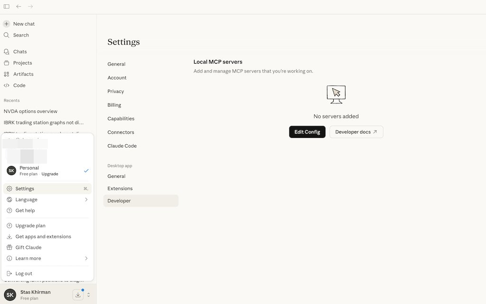

# Trading Skills — AI-Powered Market Analysis

Most retail traders juggle 5+ tabs — broker, charting platform, screener, news feed, spreadsheet — just to decide whether to enter a trade. This project collapses all of that into a single conversational interface powered by Claude.

Ask a question in plain English, get back real data: technicals, fundamentals, option Greeks, risk metrics, earnings dates, correlation matrices, and full PDF reports. Connect your Interactive Brokers account and it manages your portfolio too — finds roll candidates for expiring shorts, flags earnings risk, and generates action reports.

**Who is this for?**
- **Retail options traders** who sell premium, run PMCCs, or manage covered calls
- **Self-directed investors** who want quick fundamental + technical scans without switching tools
- **Python-literate traders** who want to extend the analysis with custom scripts
- **IBRK users** who want AI-assisted portfolio management

**Quick example** — scan for bullish setups and check PMCC viability:

```
You: Scan AAPL,MSFT,NVDA,GOOGL,AMZN for bullish trends, then check the top picks for PMCC suitability

Claude: [runs scanner-bullish → filters top scores → runs scanner-pmcc]
        NVDA: Bullish score 8/10, PMCC score 9.2/11 — LEAPS $95 call (Δ0.82),
        sell $140 call (Δ0.18), net debit $5,420, annual yield 47%...
```

**Another example** — correlation check before adding to a portfolio:

```
You: Show correlation for SPY,GOOG,NVDA,ZM,RTX,PFE,XOM

Claude: NVDA is the standout diversifier — near-zero correlation with everything.
        RTX/XOM at 0.86 — little diversification benefit between them.
```

### Real sessions in Claude Desktop (free account)

> *"Analyze option spread strategies and probability of profit for SPY, QQQ and DIA"*


## Requirements

- Python 3.12+
- [uv](https://docs.astral.sh/uv/) package manager
- [Claude Code](https://docs.anthropic.com/en/docs/claude-code), [Claude Desktop](https://claude.ai/download), or [Cursor](https://cursor.com/) with third-party skills enabled (fully installed and authenticated)
- Optional: TWS or IB Gateway for portfolio features


## Two Ways to Use

### Claude Code / Cursor (Full Experience)

#### Installation

```bash
git clone https://github.com/staskh/trading_skills.git
cd trading_skills
uv sync
```

Run Claude Code or Cursor in the repository root. All skills are available as interactive commands — ask questions about your IBKR portfolio, symbols, or companies of interest.

### MCP Server (Claude Desktop)

The MCP server is a lightweight alternative for use with Claude Desktop (including the free tier). It exposes 23 trading analysis tools directly to Claude Desktop without needing Claude Code.

#### Installation

1. Install the package (requires Python 3.12+):
   ```bash
   pip install trading-skills
   ```

2. Find the full path to the installed command:

   **macOS / Linux:**
   ```bash
   which trading-skills-mcp
   ```

   **Windows:**
   ```cmd
   where trading-skills-mcp
   ```
   If `where` doesn't find it, locate it manually:
   ```cmd
   python -c "import sysconfig; print(sysconfig.get_path('scripts'))"
   ```
   The script will be `trading-skills-mcp.exe` in that directory (typically at `C:\Users\<YourUsername>\AppData\Local\Programs\Python\Python<Version>\Scripts\`)

3. Open Claude Desktop, go to **Settings** → **Developer** → **Edit Config**:

   

   Add the following to `claude_desktop_config.json`:

   **macOS / Linux:**
   ```json
   {
     "mcpServers": {
       "trading-skills": {
         "command": "/full/path/to/trading-skills-mcp"
       }
     }
   }
   ```

   **Windows:**
   ```json
   {
     "mcpServers": {
       "trading-skills": {
         "command": "C:\\full\\path\\to\\trading-skills-mcp.exe"
       }
     }
   }
   ```
   Replace the path with the output from step 2.

4. Restart Claude Desktop. Don't worry if you see an MCP error message — it will disappear once you try some of the examples below.

#### Installation from GitHub

   Add the following to `claude_desktop_config.json`:

   **macOS / Linux:**
   ```json
   {
     "mcpServers": {
       "trading-skills": {
         "command": "uvx",
         "args": ["--from", "git+https://github.com/staskh/trading_skills.git", "trading-skills-mcp"]
       }
     }
   }
   ```

   **Windows:**
   ```json
   {
     "mcpServers": {
       "trading-skills": {
         "command": "cmd",
         "args": ["/c", "uvx", "--from", "git+https://github.com/staskh/trading_skills.git", "trading-skills-mcp"]
       }
     }
   }
   ```


## Example Queries

- "What's AAPL's current price and 1y range?"
- "Run technical analysis on SPY with RSI/MACD"
- "Scan AAPL,MSFT,NVDA,GOOGL for bullish trends"
- "Find PMCC candidates from my watchlist"
- "Compare risk metrics for MSFT vs AAPL"
- "Show correlation between SPY,NVDA,GOOG,XOM"
- "When is NVDA's next earnings?"
- "Show my portfolio positions" (requires IB)
- "Generate portfolio action report" (requires IB)
- "Find roll candidates for my GOOG short call" (requires IB)

## Available Skills (21)

### Market Data
| Skill | Description |
|-------|-------------|
| `stock-quote` | Real-time price, volume, change, market cap, 52-week range |
| `option-chain` | Calls and puts with strikes, bids, asks, volume, OI, IV |
| `price-history` | Historical OHLCV data |
| `fundamentals` | Financials, earnings, key metrics, Piotroski F-Score |
| `news-sentiment` | Recent headlines and sentiment |
| `earnings-calendar` | Upcoming earnings dates with BMO/AMC timing and EPS estimates |

### Analysis
| Skill | Description |
|-------|-------------|
| `technical-analysis` | RSI, MACD, Bollinger Bands, SMA, EMA, ATR, ADX, correlation matrix |
| `greeks` | Delta, gamma, theta, vega, IV (Black-Scholes) |
| `spread-analysis` | Verticals, diagonals, straddles, strangles, iron condors |
| `risk-assessment` | Volatility, beta, VaR, drawdown, Sharpe ratio |

### Scanners
| Skill | Description |
|-------|-------------|
| `scanner-bullish` | Scan symbols for bullish trends (SMA, RSI, MACD, ADX) |
| `scanner-pmcc` | Scan for PMCC suitability (delta, liquidity, spread, IV, yield) |

### Portfolio (requires TWS/Gateway)
| Skill | Description |
|-------|-------------|
| `ib-account` | Account summary (cash, buying power, margin) |
| `ib-portfolio` | Portfolio positions with market prices |
| `ib-option-chain` | Real-time option chain data from IB *(under development)* |
| `ib-find-short-roll` | Roll candidates for short positions or covered call/put selection |
| `ib-collar` | Tactical collar strategy for earnings/event protection |
| `ib-portfolio-action-report` | Portfolio review with earnings risk and action items |
| `ib-create-consolidated-report` | Consolidate IBRK trade CSVs into summary reports |
| `ib-report-delta-adjusted-notional-exposure` | Delta-adjusted notional exposure across accounts |

### Reports
| Skill | Description |
|-------|-------------|
| `report-stock` | Comprehensive PDF/markdown report with trend, PMCC, and fundamental analysis |

## MCP Server Tools (23 tools)

The MCP server exposes a subset of skills as tools for Claude Desktop:

| Category | Tools |
|----------|-------|
| **Market Data** | `stock_quote`, `price_history`, `news_sentiment`, `fundamentals`, `piotroski_score`, `earnings_calendar` |
| **Technical** | `technical_indicators`, `price_correlation`, `risk_assessment` |
| **Options** | `option_expiries`, `option_chain`, `option_greeks` |
| **Spreads** | `spread_vertical`, `spread_diagonal`, `spread_straddle`, `spread_strangle`, `spread_iron_condor` |
| **Scanners** | `scan_bullish`, `scan_pmcc` |
| **IB Portfolio** | `ib_account`, `ib_portfolio`, `ib_find_short_roll`, `ib_portfolio_action_report` |

## Sandbox Outputs (Not Committed)

Temporary reports, datasets, and notebooks are saved to `sandbox/` and are not committed to git. Report filenames include timestamps: `<name>_YYYY-MM-DD_HHmm.<ext>`.

## Interactive Brokers Setup

To use IB features:

1. Install [TWS](https://www.interactivebrokers.com/en/trading/tws.php) or [IB Gateway](https://www.interactivebrokers.com/en/trading/ibgateway-stable.php)
2. Enable API connections in TWS: Configure → API → Settings → Enable ActiveX and Socket Clients
3. Note the port: 7497 (paper) or 7496 (live)

## Development

```bash
# Run tests
uv run pytest tests/ -v

# Lint
uv run ruff check src/ tests/
uv run ruff format src/ tests/

# Test individual script
uv run python .claude/skills/fundamentals/scripts/fundamentals.py AAPL

# Debug MCP server with MCP Inspector
npx @modelcontextprotocol/inspector uv run python -m mcp_server.server
```

## Architecture

```
User Query → Claude Code/Desktop → Skill or MCP Tool → Python Script → Response
```

Skills are SKILL.md files in `.claude/skills/` that instruct Claude how to fetch and analyze data using Python scripts. Skill scripts live under `.claude/skills/<skill-name>/scripts/`, and progressive reference material belongs in `.claude/skills/<skill-name>/references/`.

The MCP server (`mcp_server/server.py`) wraps the same Python scripts as tools for Claude Desktop via the FastMCP framework.

## Data Sources

Market data is provided by [Yahoo Finance](https://finance.yahoo.com/) and may be delayed up to 15 minutes.

## License

MIT
